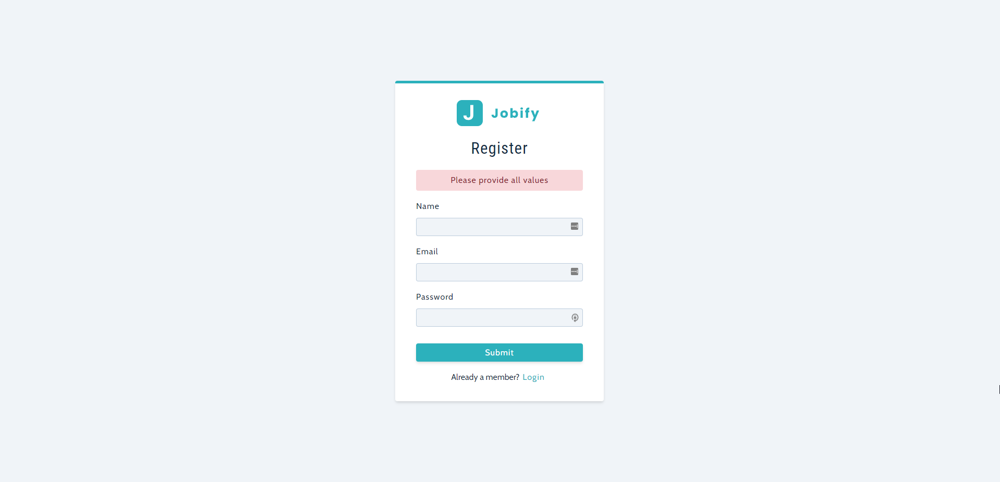
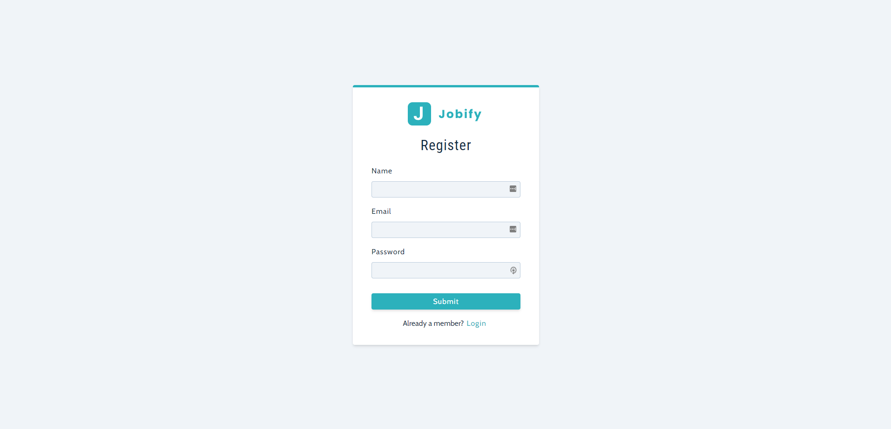
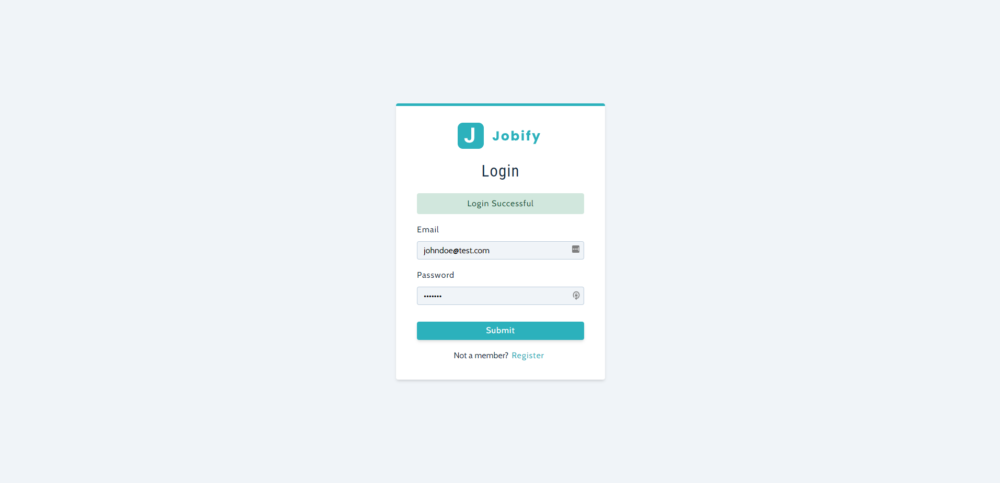

# Modern MERN Stack

Modern MERN stack with best practices and clean code

## Features
- Custom error handling
- Hashed passwords
- JSON web token
- CRUD operations
- Authentication
- Middlewares

## Environment Variables

You need to add these to **.env** file

`MONGO_URL`

`MONGO_PORT`

`JWT_SECRET`

`JWT_LIFETIME`

## Run Locally

Clone the project

```bash
  https://github.com/pakavi/modern-mern-stack.git
```

Go to the project directory

```bash
  cd modern-mern-stack
```

Install dependencies

```bash
  npm install
```

Start the server

```bash
  npm run start
```

## Screenshots






## License

[MIT](https://github.com/pakavi/modern-mern-stack/blob/main/LICENSE.md)


## Authors

[@pakavi](https://github.com/pakavi)
